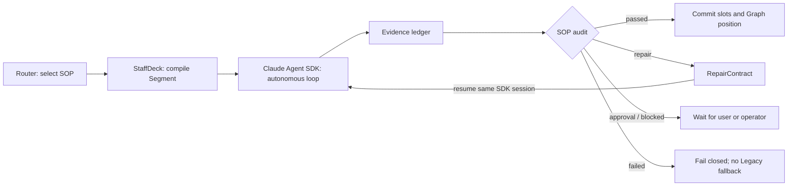

# Claude Supervised Runtime Pilot

## Runtime Flow



`legacy` remains the default. A session created with `claude_supervised` is locked to that
runtime; changing runtime requires a new session. After the first SOP selection, subsequent
turns continue the active SOP without repeatedly invoking Router. The supervised path bypasses
StepAgent continuation, ReflectionAgent, model-driven Graph progression, and ResponseAgent.

## Configuration

1. Create an enabled `ModelConfig` whose provider is `claude_agent_sdk`; store the Claude API
   key through the existing encrypted model configuration.
2. In the admin Persona settings, enable Claude Runtime, select that model, add allowed Skill
   IDs (for example `graph_demo`), and choose the maximum repair rounds.
3. Mark tools as `read`, `write`, or `destructive`. Unspecified tools resolve conservatively:
   `GET` is read-only, confirmation-required tools are destructive, and all others are writes.
4. Use `predicate_json` for deterministic branches, for example:

```json
{"slot": "request_type", "op": "in", "value": ["price", "stock"]}
```

Supported operators are `eq`, `in`, and `exists`.

## Safety and State

Claude receives no built-in tools. Each Segment exposes only its StaffDeck tools through an
in-process MCP server; execution still passes through the existing ToolExecutor, authorization,
confirmation, and idempotency controls. Write and destructive segments stop for explicit user
approval before Claude can invoke them.

`runtime_state_json` stores the SDK session ID, active run, checkpoints, repair state, metrics,
and failure diagnostics. Candidate replies and slot updates are buffered until evidence audit
passes. Tool results, knowledge references, approvals, artifacts, and runtime events form the
evidence ledger. Cancellation interrupts the active SDK client and preserves diagnostic state.

## Validation

Run:

```powershell
python -m pytest backend/tests/test_sop_supervisor.py backend/tests/test_claude_runtime_contract.py backend/tests/test_claude_supervised_agent_loop.py
python -m ruff check backend
npm --prefix frontend-enterprise run build
```

The pinned SDK is `claude-agent-sdk==0.2.123`. A live Claude Graph Demo run still requires an
administrator-provided API key; SDK failure never falls back to Legacy Runtime.
